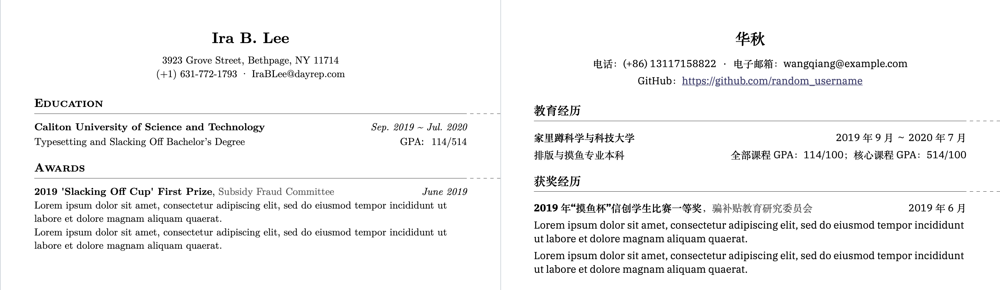

# Typst CV Template

> 该模板支持中文

A minimalist and elegant template for Typst.



## How to use

Copy the templates inside the `src` folder to your workspace.

Import one of the template inside your document. For example:
```typst
#import "cv_template_en.typ": *
```
Configure the document. For example:
```typst
#show: doc => conf(
  name: "Ira B. Lee",
  address: "3923 Grove Street, Bethpage, NY 11714",
  phone: "(+1) 631-772-1793",
  email: "IraBLee@dayrep.com",
  doc,
)
```

And start writing.

## Example code


### 中文

```
#import "cv_template_zh.typ": *

#show: doc => conf(
  name: "王强",
  phone: "电话：(+86) 13117158822",
  email: "电子邮箱：wangqiang@example.com",
  info: [GitHub：#cv_link("https://github.com/random_username")],
  doc,
)

= 教育经历

#cv_block(
  name: "家里蹲科学与科技大学",
  date: "2019年9月 ～ 2020年7月"
)

排版与摸鱼专业本科
#h(1fr)
全部课程GPA：114/100；核心课程GPA：514/100

= 获奖经历

#cv_block(
  name: "2019年“摸鱼杯”信创学生比赛一等奖",
  entity: "骗补贴教育研究委员会",
  date: "2019年6月"
)

#lorem(20)

#lorem(20)
```

### English

```
#import "cv_template_en.typ": *

#show: doc => conf(
  name: "Ira B. Lee",
  address: "3923 Grove Street, Bethpage, NY 11714",
  phone: "(+1) 631-772-1793",
  email: "IraBLee@dayrep.com",
  doc,
)

= Education

#cv_block(
  name: "Caliton University of Science and Technology",
  date: "Sep. 2019 ~ Jul. 2020"
)

Typesetting and Slacking Off Bachelor's Degree
#h(1fr)
GPA：114/514

= Awards

#cv_block(
  name: "2019 'Slacking Off Cup' Innovation Student Competition First Prize",
  entity: "Subsidy Fraud Education Research Committee",
  date: "June 2019"
)

#lorem(20)

#lorem(20)
```